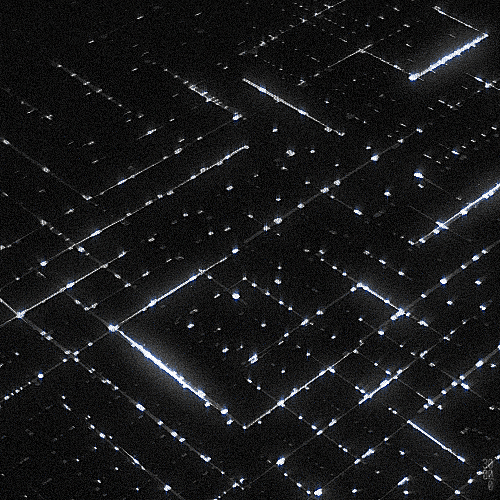

# Bautista Suarez - AI Engineer

  
    
  
  
  

## Hi there! 👋 I'm Bautista Suarez

AI Engineer specializing in **Python 🐍, Go, and Rust**. I help companies **save time and money** with intelligent automations, AI agents, and scalable workflows. Lifelong Python enthusiast!

- **Experience**: 3 years Backend | 1 year Data Analysis | 1 year AI Engineering
- 🌱 **Currently**: Building multi-tool agents and LangGraph orchestrations
- 💬 **Ask me about**: CrewAI, FastAPI, N8N, or integrating LLMs in production
- ⚡ **Fun fact**: My first Python script almost automated my morning coffee (close enough).

### 🛠️ Tech Stack

### 🎯 Expertise Levels

**🟢 Expert**: Python, Go, Rust, CrewAI, Pandas, NumPy  
**🟡 Intermediate**: LangGraph, LangChain, Streamlit

### 📫 Let's Connect

Thanks for stopping by! 🚀